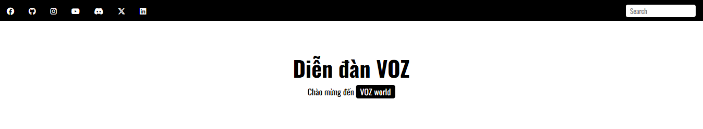
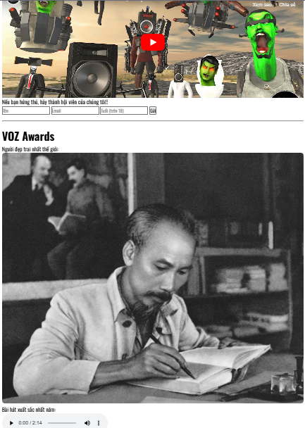
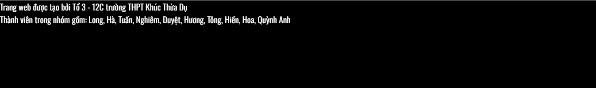

### Phân nhiệm vụ:

-   `Hà, Hiền, Nghiêm` [làm phần Header ](#1-header-hà-hiền-nghiêm-link)
-   `Tuấn, Tông, Hương` [làm phần nội dung chính](#2-phần-nội-dung-chính-tuấn-hương-tông)
-   `Quỳnh Anh, Long` [làm phần Sidebar](#3-sidebar-quỳnh-anh-long)
-   `Duyệt` [làm phần Footer](#footer-duyệt) + tìm các hiểu các thuộc tính css (**position**, **flex**) của css
-   `Hoa` tìm hiểu chung với `Duyệt` và giúp các bạn khác.

# 1: Header (Hà, Hiền, Nghiêm)

Đây được gọi là phần đầu, header của web.

Phần đâu này được chia thành 2 phần nhỏ nữa được gọi là: `first-Header` và `second-header`.

Phần first-header (nền đen) được làm bởi css, thuộc tính quan trọng là display-flex (dùng để cho hết các phần tử nằm trên cùng 1 hàng). Còn cách để cho 2 phần mạng xã hội và search box cách nhau ra xa là dùng justify -content-center.

Còn second-header (nền trắng) có đặt sẵn chiều cao cố định. Rồi dùng thuộc tính position để căn chỉnh cho nó ở giữa phần tử cha (phần tử trằng)

Phần này được tách ra (không phải header). Tên của nó trong trang là `Hero`

Phần to đùng này cách làm cũng tương tự như `second-header`. Chỉ thay ảnh vào

# 2: Phần nội dung chính (Tuấn, Hương, Tông)

Phần này nâng cao. **Hương** làm phần html. **Tông** và **Tuấn** làm phần css như: `h1`, `h4`, `p`, `button`, ...

# 3: Sidebar (Quỳnh Anh, Long)

Chỗ này sẽ có nhúng video trên `youtube` và có 1 chỗ để điền dữ liệu (dùng `input`)

Dưới phần VoZ Awards là lần lượt dùng thẻ html:

| Thẻ html | Công dụng                   |
| -------- | --------------------------- |
| `img`    | Hiển thị ảnh                |
| `audio`  | Hiển thị âm thanh (bài hát) |

# Footer (Duyệt)

Đặt chiều cao cho nó và viết chữ vào. Đơn giản.
